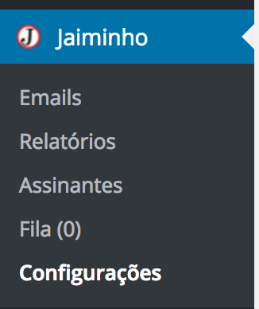
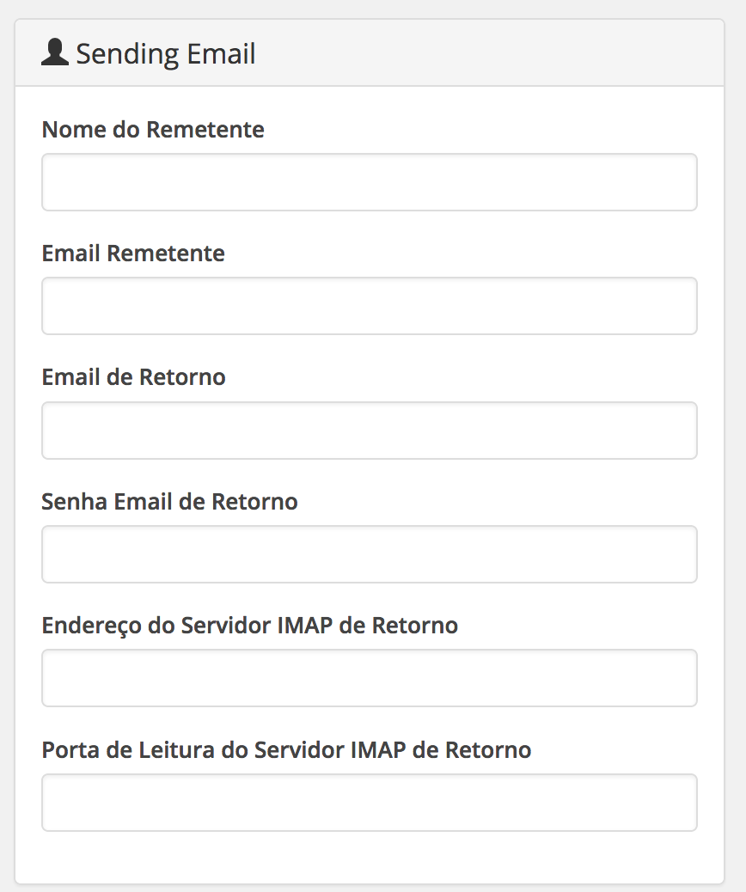
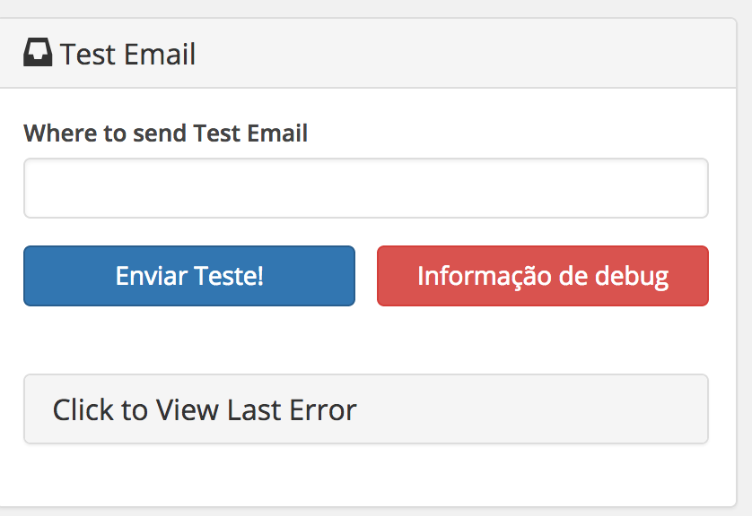
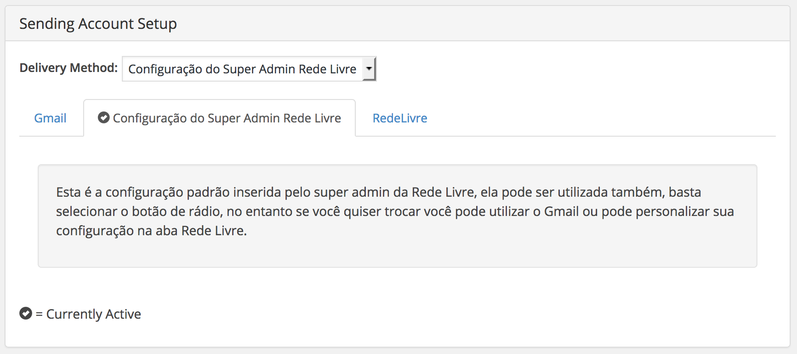
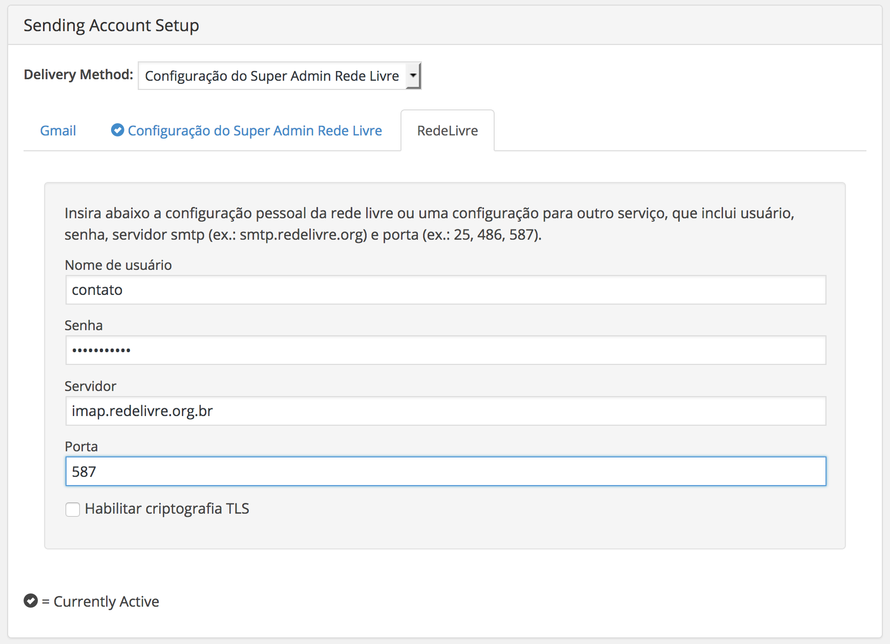
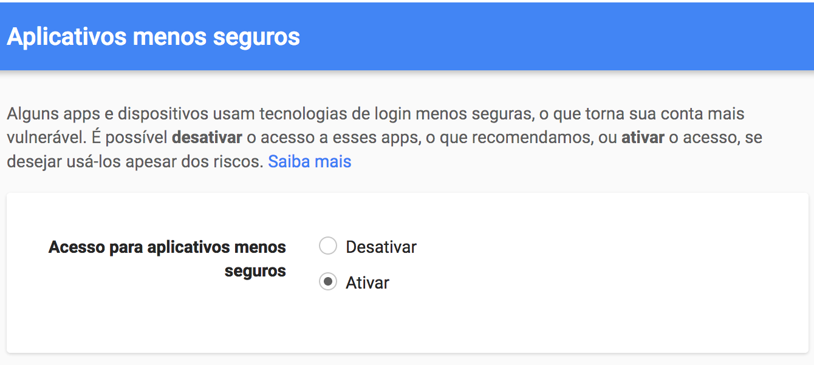

# Configurações Iniciais
Antes de começar a utilizar o Jaiminho, ajuste as configurações iniciais do boletim.

Você possui duas formas de chegar a configurações:

1) no menu da lateral esquerda:

2) No topo da tela do cinza ao lado do menu da lateral esquerda:

Basta clicar en configurações e pronto!

## Configurações de Conta
Agora é hora de informar suas configurações de conta:

Coloque um nome de remetente como “Rede Livre”, Email como “contato@redelivre.org.br”,  um email de retorno de erros “bounce@redelivre.org.br”, a senha do email de retorno “”, o endereço do servidor imap “imap.redelivre.org.br”, e a porta do servidor impa “993”.

## Enviar Email de Teste
Para enviar um email de teste precisados de configurar antes uma conta de envio. Apesar dele ser a caixa ao lado, não sera enviado nada se não temos uma conta de envio configurada.

Se você já possui uma conta configurada basta inserir um email para testar sua configuração de envio no formulário similar a este:

E clicar em Enviar Teste!

Para ver mais infos você pode clicar no botão vermelho.

## Configuração da Conta de Envio

O Jaiminho oferece 3 tipos de conta de envio de mensagens como podemos ver na figura abaixo, note as abas “Gmail”, “Configuração do Super Admin Rede Livre” e “RedeLivre”:

Basta selecionar em Método de Entrega qual o método que você vai utilizar para enviar suas mensagens. Abaixo passamos a apresentar cada método de entrega. 📦

### Configuração do Super Admin Rede Livre ❤️

Este é o método mais simples. Basta ativar ela que você vai utilizar o sistema de envio de emails do servidor da redelivre, que é configurado previamente pelo Super Admin.

### RedeLivre

Este método de envio consta de quatro campos: “Nome de usuário”, “Senha”, “Servidor” e “Porta”.

A critério de exemplo é possível preencher os campos sucessivamente com: contato, , imap.redelivre.org.br, 587

### Gmail

Para usar o gmail você precisa habilitar em sua conta escolhida a possibilidade de autenticação de ferramentas menos seguras. Neste link existe uma descrição do funcionamento deste recurso: [Permitir que aplicativos menos seguros acessem sua conta - Ajuda do Conta do Google](https://support.google.com/accounts/answer/6010255?hl=pt-BR) .

Neste outro link você pode ativar a autenticação para ferramentas menos seguras no email do gmail em que você estiver logado em seu navegador: [Configuración de la cuenta: no se admite tu navegador](https://www.google.com/settings/security/lesssecureapps).

O preenchimento dos campos do Gmail são muito simples. Basta escrever seu nome de usuário e senha para a conta escolhida e não esquece de modificar o Método de Envio na caixa dropdown para Gmail.

## Configurações Avançadas de Envio

Nesta configurações é possível gerenciar a quantidade limite de email por dia e por hora de maneira que o gestor controle o seu gasto de créditos.

Também é possível definir qual o conjunto de caracteres que ira ser utilizado nas mensagens. Isto permite utilizar conjuntos de caracteres que facilitam a escrita em chinês por exemplo.
