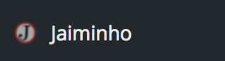
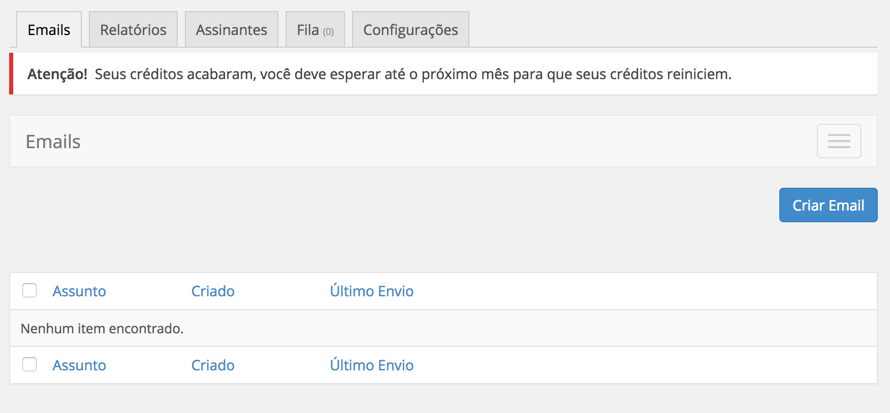

# Jaiminho
Ao entrar no seu blog pela primeira ve você vai encontrar o Jaiminho na lateral esquerda:

Basta clicar neste ícone com a o nome do Jaiminho ao lado.

Ao abrir o Jaiminho ele mostra todas essas opções:

E ao lado você vai ver a tela de composição de novas mensagens:

Agora que você já sabe como chegar no Jaiminho veja as configurações iniciais para entender mais sobre como configurar seu Jaiminho.
