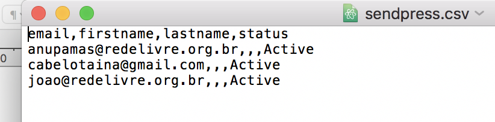

# assinantes
Neste página você consegue ver todas as listas e os assinantes inscritos no seu Jaiminho:

### Listas

Nesta tabela você pode ver qua temos 4 colunas, sendo que a primeira mostra o nome da lista de assinantes, mostra o numero de pessoas ativas, quando foi a data o ultimo envio (quando essa lista foi utilizada pela ultima vez), e por ultimo temos as ações que podemos ser realizadas sobre essa lista.

As ações que podem ser realizadas sobre essa lista são:

**Ver**: permite ver uma lista dos assinantes;
**Importar**: permite importar novos assinantes por meio de um arquivo cdv (planilha a moda antiga); 
**Adicionar**: permite adicionar um assinante por meio de um formulário, ou por meio de um textarea (Campo Grande que permite colocar um email a cada linha e que adiciona vários assinantes por vez);
**Exportar**: permite exportar sua lista de assinantes;
**Formulario** : permite obter o html de um formulário que por sua vez uma vez que preenchido por qualquer pessoa permite que ele passe a fazer parte desta lista.

### Ver

Nesta tela podemos ver todas os assinantes que temos nesta lista. Note que temos 5 colunas, O email do assinante, o seu primeiro nome, o ultimo nome, seu status nesta lista, e a data em que entrou nesta lista.

Existe também o perigo botão remover todos os usuários desta lista, identificado em vermelho:

Você também pode selecionar cada um dos assinantes que quer remover e realizar uma ação em massa de remoção de assinantes:

Pode filtrar seus assinantes de vários modos, qualquer status/ Any Status (aparecem todos), Não Confirmado_Unconfirmed (pessoas que se inscreveram mas não acessaram o link de confirmação que foi enviado para o email dela), Ativo_Active  pessoas que estão ativas no sistema, Desinscritos/Unsubcribed pessoas que deixaram a lista, Bounced pessoas que ao enviar mensagens por algum motivo as mensagens retornaram. 

### Importar

Aqui você pode importar CSV  com lista de usuário,  note abaixo tenho um CSV muito simples que possui apenas uma coluna (email) com 3 emails.

Essa lista poderia ser com 1k emails, sem problemas o sistema permite a você importar do mesmo jeito que vamos mostrar para você. Vamos lá. Vá ate a tela inicial dos assinantes e escolha a lista onde você quer importar seus novos assinantes. Note que você pode fazer isso para várias listas.

Após encontrar a lista que você quer importar seus novos assinantes clique em:

Muito bem agora você vai ver uma tela como esta:

Clique em examinar e passe e selecione o arquivo que você quer importar:

No meu caso eu tenho o arquivo emails.csv que apresentamos acima. Selecione ele. Você vai ficar com seu campo de anexo de arquivo assim:

Aperte o botão upload e você vai ser redirecionado para uma página similar a esta:

Basta dizer do que se trata a coluna com emails, se você tiver mais colunas informe ao sistema se elas se enquadram com algum dos filtros:

As que não se enquadram com nenhum deste filtros marque apenas No Match. Por fim clique em:

E você vai ter seu emails importados para sua lista:

### Adicionar um ou mais usuários por meio de formulário ou textarea

Veja como é simples adicionar um usuário por meio de um formulário, na página principal de assinantes selecione a lista que você objetiva importar um novo assinante e clique no botão Adicionar:

Você deve ser redirecionado para esta tela:

Preencha o formulário com as informações que você possui do seu novo assinante e clique em enviar.

Para adicionar um conjunto de assinantes você pode inserir neste campo um assinante por linha, algo similar a isso:

Note que estou tratando do mesmo email apenas para critério de exemplo. Você claramente vai inserir um usuário diferente por linha.

### Como exportar suas listas de assinantes

Vá ate a páginas principal de assinantes e seleciona a lista que objetiva exportar:

Agora basta clicar uno botão Exportar e pronto. Vai aparecer uma caixa como esta para você selecionar onde quer salvar o seu download:

Salve onde quiser e depois abra a lista e veja seus assinantes e as infos que possui deles:

As colunas correspondem a primeira linha enquanto as linhas começam a partir da segunda linha. Veja que os dados estão separados por virgulas. Se não há conteúdo entre virgulas é `porque a coluna não esta preenchida para aquele assinante.

### Obter um formulário para aquela lista

Essa é uma tarefa simples que o Jaiminho fornece. Você apenas deve entrar  na página principal assinantes e selecionar a lista que você quer obter um formulário e clicar em Formulário:

Você sera enviado para a seguinte tela:

Selecione qual o tipo de página que vai ser usado em seu formulário, você pode selecionar a página padrão ou pode criar sua própria página. Bem como obter resultados em JSON ou redirecionar a uma url especifica. Por fim basta copiar o html (formulário) gerado e colar no seu código html.

### Ver todos os assinantes em suas listas

Para ver isso é muito simples, vá a ate a página principal de assinantes e veja que existe um menu:

Clique em All Subscribers. E você vai ser redirecionado para a seguinte tela:

Aqui você pode basicamente incluir um novo assinante. Editar assinantes individualmente. Remover todos os assinantes e exportar todos os assinantes. Existe uma ação em massa que permite remover assinantes específicos que você selecionar por meio da checkbox em cada linha.
