# Configurações iniciais
Antes de começar a utilizar o Jaiminho, ajuste as configurações iniciais do boletim. 

Você possui duas formas de chegar a configurações:

1) no menu da lateral esquerda:

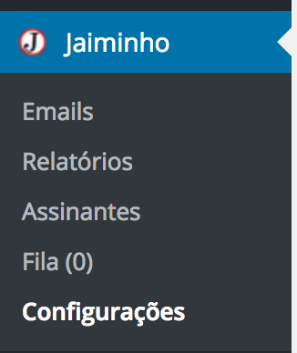

2) No topo da tela do cinza ao lado do menu da lateral esquerda:

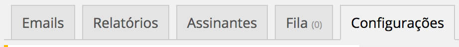

Basta clicar en configurações e pronto!

## Configurações de Conta
Agora é hora de informar suas configurações de conta:

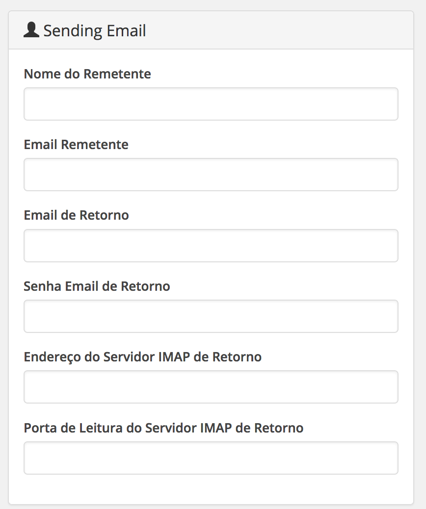

Coloque um nome de remetente como “Rede Livre”, Email como “contato@redelivre.org.br”,  um email de retorno de erros “bounce@redelivre.org.br”, a senha do email de retorno “”, o endereço do servidor imap “imap.redelivre.org.br”, e a porta do servidor impa “993”.

## Enviar Email de Teste
Para enviar um email de teste precisados de configurar antes uma conta de envio. Apesar dele ser a caixa ao lado, não sera enviado nada se não temos uma conta de envio configurada.

Se você já possui uma conta configurada basta inserir um email para testar sua configuração de envio no formulário similar a este:

E clicar em Enviar Teste!

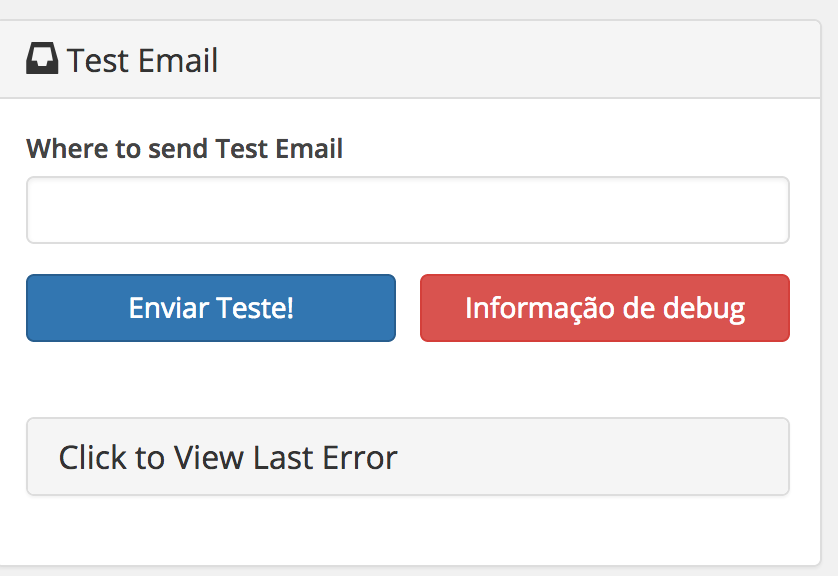

Para ver mais infos você pode clicar no botão vermelho.

## Configuração da Conta de Envio

O Jaiminho oferece 3 tipos de conta de envio de mensagens como podemos ver na figura abaixo, note as abas “Gmail”, “Configuração do Super Admin Rede Livre” e “RedeLivre”:

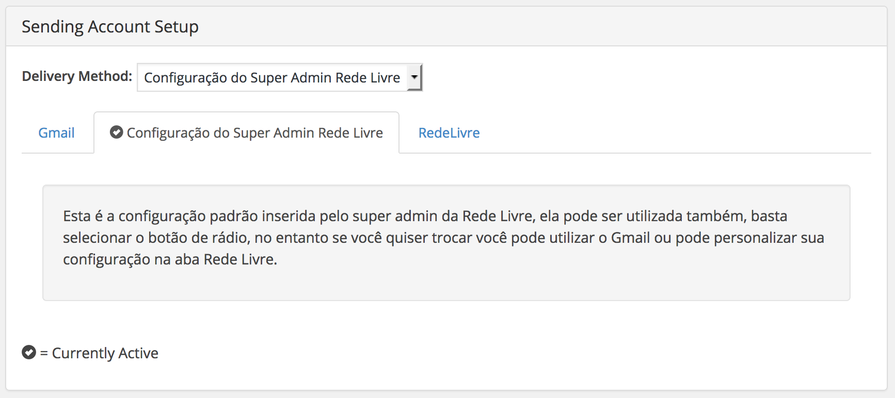

Basta selecionar em Método de Entrega qual o método que você vai utilizar para enviar suas mensagens. Abaixo passamos a apresentar cada método de entrega. 📦 

### Configuração do Super Admin Rede Livre ❤️

Este é o método mais simples. Basta ativar ela que você vai utilizar o sistema de envio de emails do servidor da redelivre, que é configurado previamente pelo Super Admin.

### RedeLivre

Este método de envio consta de quatro campos: “Nome de usuário”, “Senha”, “Servidor” e “Porta”.

A critério de exemplo é possível preencher os campos sucessivamente com: contato, , imap.redelivre.org.br, 587

### Gmail

Para usar o gmail você precisa habilitar em sua conta escolhida a possibilidade de autenticação de ferramentas menos seguras. Neste link existe uma descrição do funcionamento deste recurso: [Permitir que aplicativos menos seguros acessem sua conta - Ajuda do Conta do Google](https://support.google.com/accounts/answer/6010255?hl=pt-BR) .

Neste outro link você pode ativar a autenticação para ferramentas menos seguras no email do gmail em que você estiver logado em seu navegador: [Configuración de la cuenta: no se admite tu navegador](https://www.google.com/settings/security/lesssecureapps).

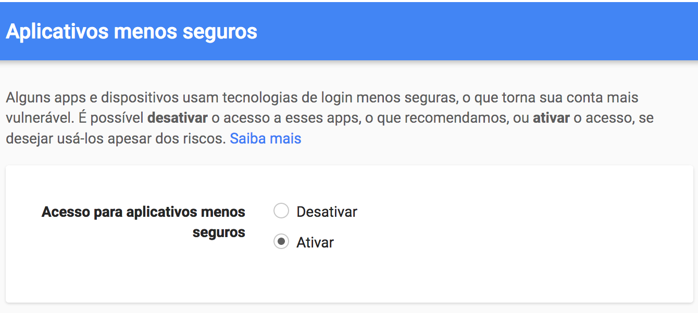

O preenchimento dos campos do Gmail são muito simples. Basta escrever seu nome de usuário e senha para a conta escolhida e não esquece de modificar o Método de Envio na caixa dropdown para Gmail.

## Configurações Avançadas de Envio

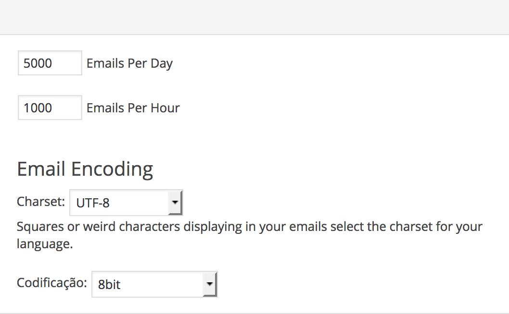

Nesta configurações é possível gerenciar a quantidade limite de email por dia e por hora de maneira que o gestor controle o seu gasto de créditos. 

Também é possível definir qual o conjunto de caracteres que ira ser utilizado nas mensagens. Isto permite utilizar conjuntos de caracteres que facilitam a escrita em chinês por exemplo.

# Menu das configurações
A area de configurações possui um menu. Nele encontramos o seguinte:

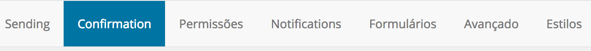

**Sending**: Você acabou de ler acima, e se não leu ainda é a primeira parte deste documento, nela você configura sua instalação para envio de mensagens, recebimento de erros no envio, define a quantidade de email enviados por hora, por dia e muito mais.

**Confirmation**:  Você pode configurar as páginas de inscrição e desinscrição, bem como definir qual a página de configuração dos assinantes, definir qual template é o padrão e como é a mensagem de dupla confirmação de inscrição, para que entenda melhor o processo sugerimos ler este texto do mail chimp: [Descripción del proceso de opt-in doble | MailChimp.com: Artículo de Base de Conocimiento](http://kb.mailchimp.com/es/lists/signup-forms/understanding-the-double-opt-in-process)

**Permissões**: Nesta página o usuário tem informações sobre o que pode fazer cada papel no Jaiminho. Aqui é possível configurar seu plugin para estes papeis.

**Notifications**: 

**Formulários**: Nesta página você pode gerenciar seus formulários, estes formulários são de dois tipos  - assinatura inicial (signup) e gerenciamento de assinatura (Manage Subscription)

**Avançado**: Aqui você pode fazer varias correções em seu sistema bem como desfazer algumas configurações voltando elas ao valor original.

**Estilos**: Aqui você pode configurar como é o template padrão do seu sistema. (Ainda não temos certeza mas acreditamos que isso apenas serve para envio de mensagens no modelo antigo, isso pode ser selecionado quando for criar um novo email em Emails >> Criar Email)

## Confirmações
Nesta área você consegue definir a página de inscrição em sua newsletter, definir a página onde seus assinantes podem gerenciar suas inscrições., página de desinscrição e muito mais.
 

As páginas do Jaiminho podem conter ou não o cabeçalho e o rodapé do seu site e você escolhe isso bem aqui:

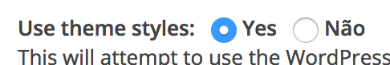

Se você escolher Sim (YES) ou Não (NO).

### Gerenciar página onde os assinantes fazem suas inscrições:

Aqui basicamente você pode utilizar a página padrão do sistema ou pode selecionar uma página que você mesmo criou. Para isso troque a opção de Usar página padrão do SendPress (Use default SendPress Page) para Redirecionar para (Redirect to) e na caixa de seleção seleciona a pagina que você criou. Se você não sabe criar páginas veja este artigo https://www.kinghost.com.br/blog/2016/12/como-criar-e-editar-conteudos-wordpress/

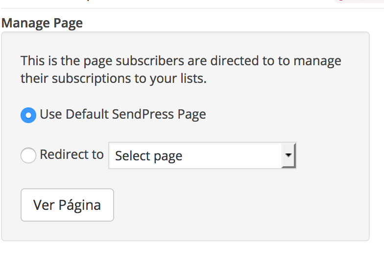

### Gerencia página onde os assinantes confirmam sua inscrição

Esta caixa controla qual a página para confirmação de inscrição os usuários ou são enviados a página que esta no padrão ou podem ser enviados para a página que você selecione em Redirecionar para (redirect to):

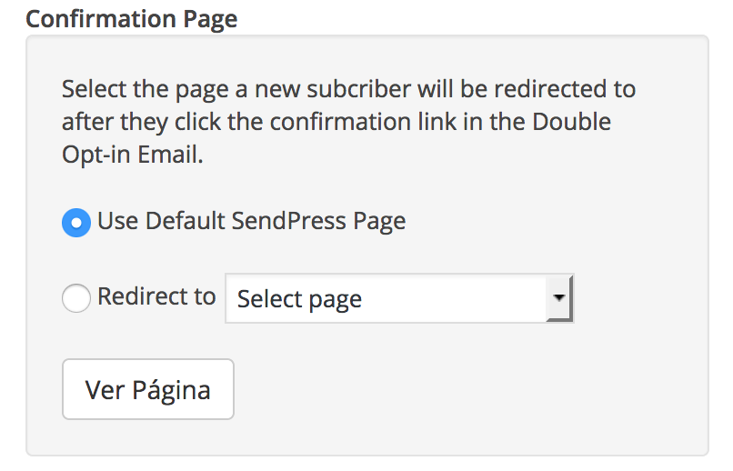

### Gerenciar página de desinsbcrição de assinantes

Nesta caixa você seleciona qual am página onde os assinantes se desinscrevem de suas newsletters. Ou você pode usar o padrão ou definir uma nova página. 

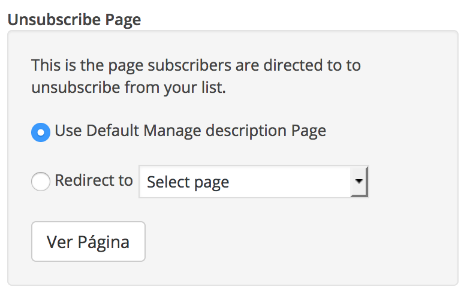

### se você estiver usando formulários personalizados como fica a página?

Basta clicar no botão abaixo e ver como fica isso.

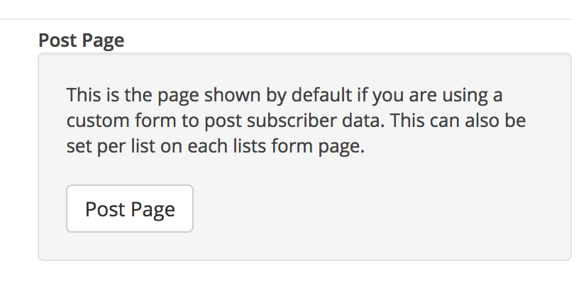

### Enviar email para que o novo assinante habilite sua conta

Note que isso é um sistema de autenticação dupla. Com isso você garante que quem assinou sua newsletter foi o dono do email e não qualquer pessoa. Isso é importante pois evita que sua lista de assinantes tenham emails inválidos. Sendo assim sugerimos fortemente o uso deste recurso.

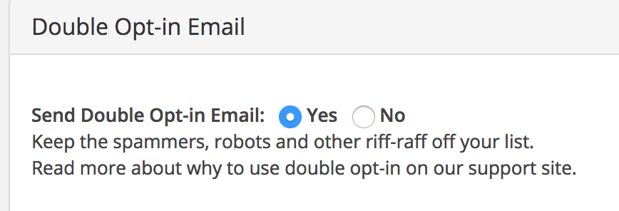

### Configure a a mensagem que é enviado aos usuários

Note que ao optar pelo sistema de autenticação dupla você deve personalizar a mensagem padrão que é enviada aos usuários:

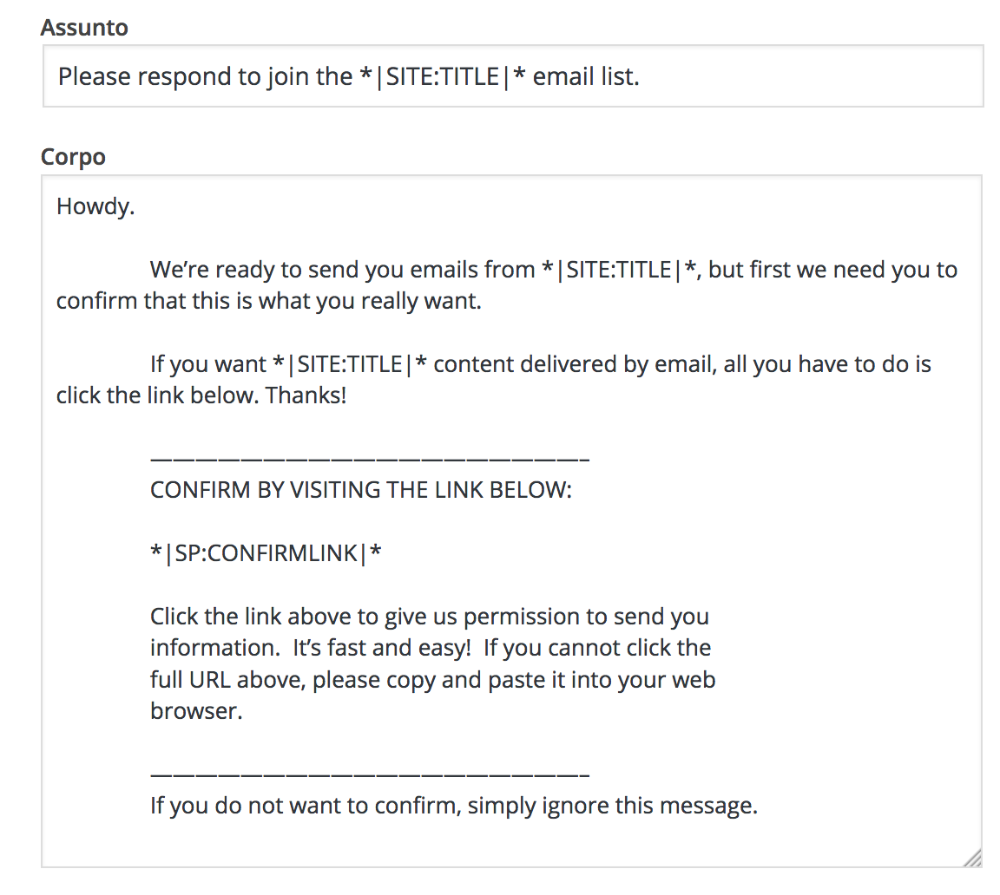

Você pode usar as seguintes tags para inserir informações dinâmicas (link de confirmação, titulo do website, e email que o usuário usou para cadastrar) copie o código e coloque no campo anterior que apresentamos.

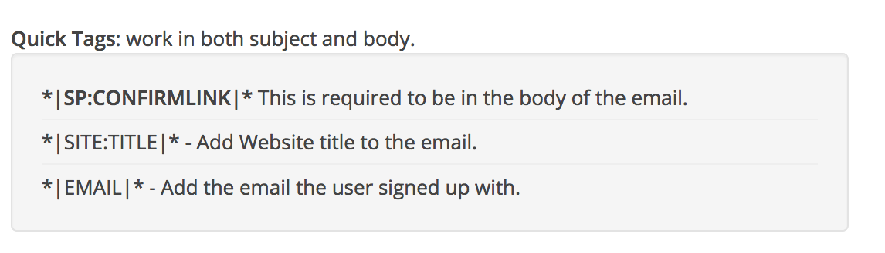

Por fim selecione o template que vai utilizar:

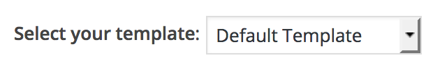

Se não gostou de nenhum destes templates faça um clone de um template em **Emails** > **Modelos** e clique no botão **Editar** do seu novo clone e crie o seu template.

## Permissões

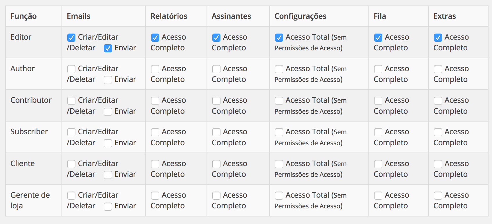

As permissões são uma matriz onde podemos encontrar basicamente os papeis na coluna função e quais as permissões de cada papel:

Criar_Editar_Deletar e ou Enviar Emails
Acesso completo a Relatórios de Envio de Emails
Acesso completo a lista de assinantes
Acesso total as configurações
Acesso completo a Fila de envio de mensagens
Acesso completo aos Extras (note que no presente momento não sabemos o que seriam os extras)

## Notifications

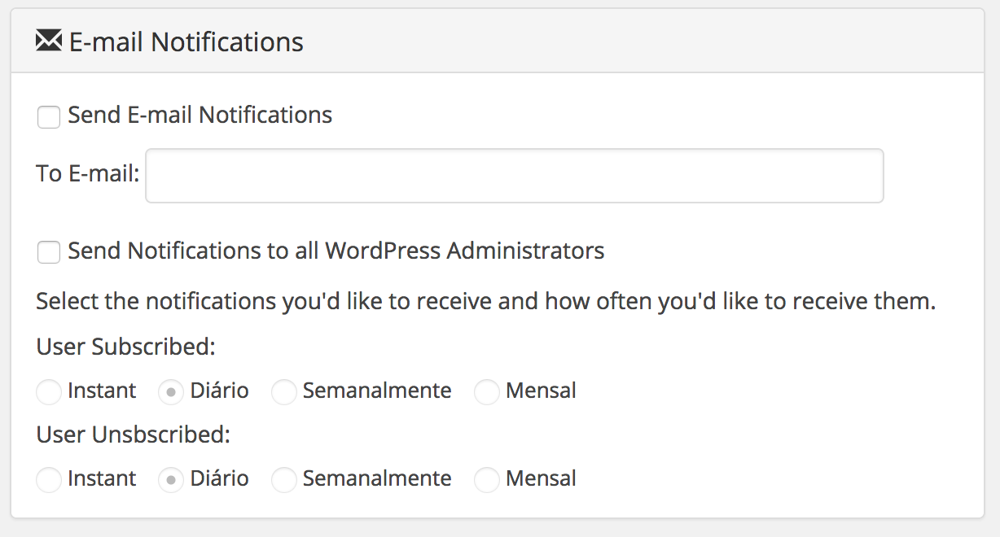

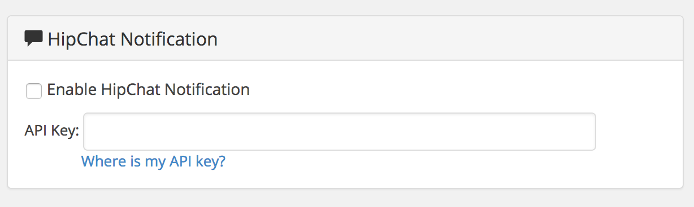

## Formulários

Neste página você consegue criar um shortcode que você insere em uma página ou post qualquer, e com isso você passa a ter um formulário personalizado para inscrição em suas newsletters:

### Criando meu primeiro formulário

Para iniciar o processo de criação aperte o botão:

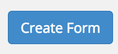

Em seguida você passa a ver o seguinte formulário:

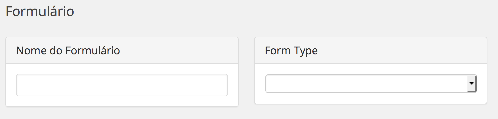

Defina o nome do seu novo formulário e o tipo do formulário (Form Type) são dois tipos de formulários (para entrar na newsletter e para o assinante gerenciar as listas que ele esta inscrito). A primeira se chama **Signup** e a segunda **Manage Subscriptions**.

Por exemplo ao iniciar o processo de criação de um formulário do tipo signup você tem as seguintes possibilidades:

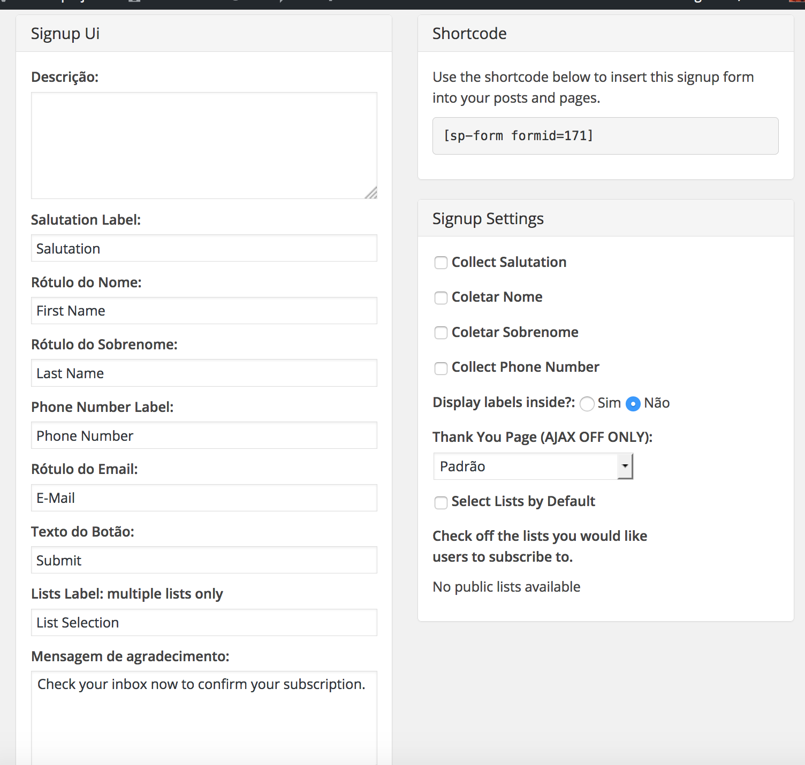

E para fazer um formulário do tipo manage subscription, tera os seguintes campos:

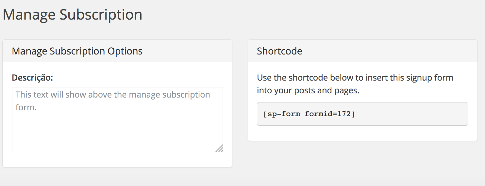

## Avançado:

Aqui você pode reparar suas tabelas de banco de dados relacionada ao Jaiminho apenas apertando este botão. Se você sentir que algo esta estranho com seus templates e configurações 🎲 aperte Opções de Correção de Dados (Data Fix Options)

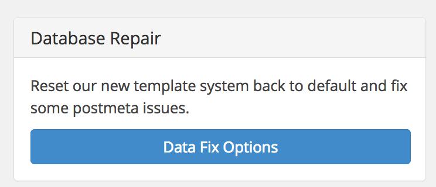

Isso vai abrir uma página com duas opções:

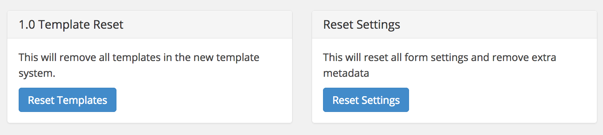

Veja que basicamente você pode remover os templates e voltar a ter apenas 2 templates (System Starter e Responsive Starter), abaixo apresentamos os templates que você facilmente pode encontrar em **Emails** >> **Modelos**.  

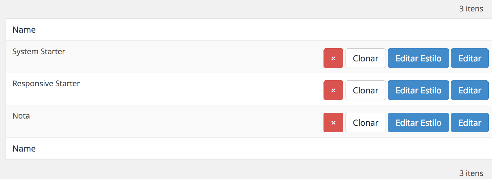

E você pode resetar (reiniciar) todas as configurações para o padrão inicial. Ao clicar em Reset Settings. Neste caso são todas as configurações ensinadas nesta sessão. Por isso **CUIDADO**.

### Permita que a equipe do SendPress monitore seu uso do plugin

Ao clicar na checkbox na imagem você permite que a equipe do sendpress tenha informações do seu uso do plugin. Acreditamos que essa seja uma importante contribuição por isso encorajamos nossos usuários a habilitar esse tipo de configuração.

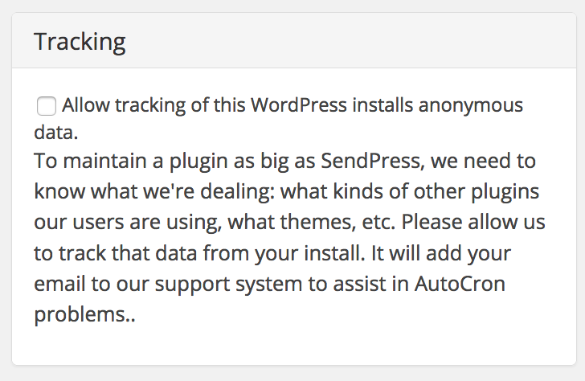

### Javascript e CSS

Ainda não temos claro quais as alterações desta configuração se tiver clareza envia a sua contribuição. (Baixe o repositório faça a modificação no texto e envie um pull request, se tiver duvida sobre como fazer isso envie uma mensagem para contato@redelivre.org.br)

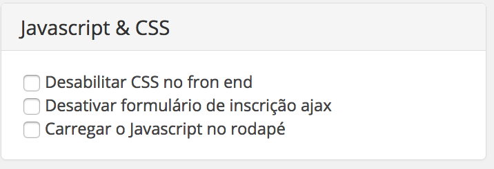

### Permitir a inserção de shortcodes no widgets

Se não sabe o que é shortcode e muito menos widget veja aqui:

[Cómo utilizar los shortcodes en WordPress](http://manuelvicedo.com/wordpress/guia-shortcodes/)
[¿Qué son y como usar los Widgets en WordPress?](https://lievanosan.com/que-son-y-como-usar-los-widgets-en-wordpress/)

Uma vez que saiba o que e quer usar shortcodes em widgets basta clicar na checkbox e salvar para habilitar:

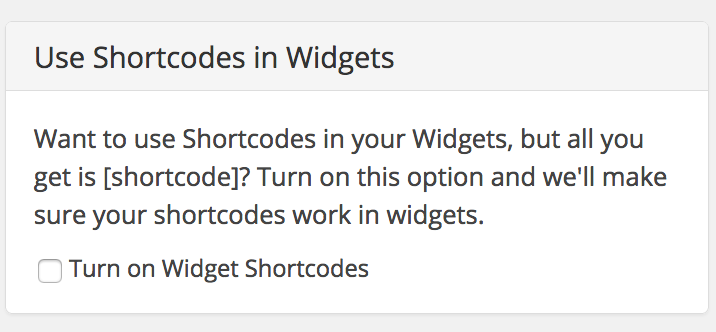

Note que você vai saber se precisa disso se ao tentar inserir um shortcode aparecer apenas [shortcode] como resultado dessa tentativa.

### Configurando os limites do sistema

Nesta seção você pode configurar os limites do sistema.

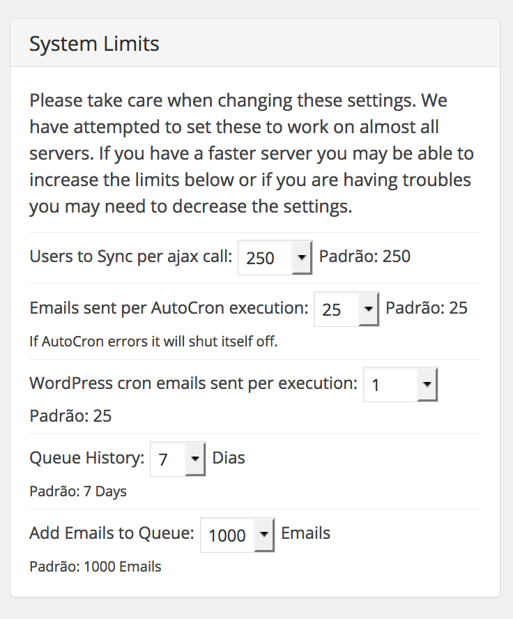

 Veja que é possível configurar quantos usuários são sincronizados por chamada Ajax (Ainda não temos claro quais as alterações desta configuração se tiver clareza envia a sua contribuição. Baixe o repositório faça a modificação no texto e envie um pull request, se tiver duvida sobre como fazer isso envie uma mensagem para contato@redelivre.org.br).

Note que a rede livre não utiliza o AutoCron por isso não se preocupe com:

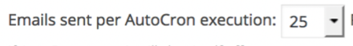

Número de mensagens enviadas por execução do cron do Wordpress, sugerimos algo que seja alto:

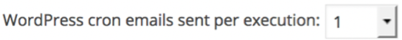

Numero de dias que um email dura no histórico da fila:

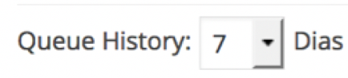

Não temos certeza ainda mas acreditamos que é o numero de emails que são inseridos por vez na fila, no entanto ainda não faz muito sentido:

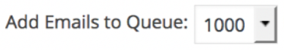

### Configurações Opcionais

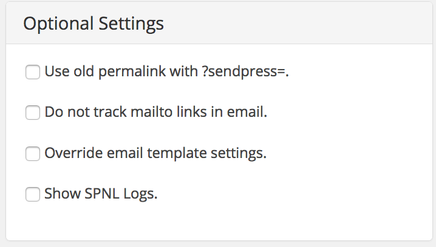

#### Use old permalink with ?sendpress=. 

Basicamente o usuário pode usar urls antigas com “?sendpress=”, em caso de ter problemas com as urls (assinante não esta conseguindo ver o email no navegador) se isso acontecer essa opção pode ajudar.

#### Do not track mailto links in email. 

Primeiro se você não sabe o que é um mailto veja o texto: [Uso de mailto en HTML](http://www.webtaller.com/construccion/lenguajes/html/lessons/uso_de_mailto_en_html.php)

Basicamente esses links não vão ser transformados. Aparentemente o sendpress não faz nada com essa informação mas é necessário mais estudo:

(Ainda não temos claro quais as alterações desta configuração se tiver clareza envia a sua contribuição. Baixe o repositório faça a modificação no texto e envie um pull request, se tiver duvida sobre como fazer isso envie uma mensagem para contato@redelivre.org.br).

#### Override email template settings. 

(Ainda não temos claro quais as alterações desta configuração se tiver clareza envia a sua contribuição. Baixe o repositório faça a modificação no texto e envie um pull request, se tiver duvida sobre como fazer isso envie uma mensagem para contato@redelivre.org.br).

#### Show SPNL Logs. 

(Ainda não temos claro quais as alterações desta configuração se tiver clareza envia a sua contribuição. Baixe o repositório faça a modificação no texto e envie um pull request, se tiver duvida sobre como fazer isso envie uma mensagem para contato@redelivre.org.br).

### Informações de Tabelas

Você pode ter informações sobre como estão suas tabelas o sendpress testa se as tabelas estão bem formadas, ou seja se elas não possuem erros que causariam algum tipo de estrago no seu sistema:

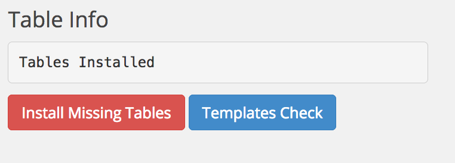

Para saber se esta tudo bem ou não basta clicar em template check (checagem dos templates) que basicamente são as três tabelas.

Se tudo estiver ok você vai ver:

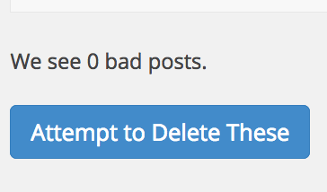

Caso haja problemas instale as tabelas que estão faltando clicando em Install Missing Tables.

## Estilos
Nesta página não sabemos ao certo o qual o email que esta sendo estilizado, temos uma ideia de que seja o email enviado para assinantes de uma newsletter.

O que pode ser definido neste estilo? Estilos do corpo de texto, podemos ver que o fundo (background), a cor do texto do corpo de texto (Body Text Color) e a cor dos links do corpo de texto (Body Link Color).

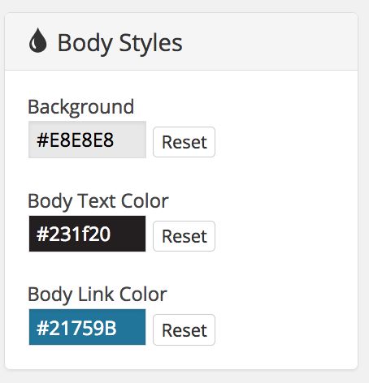

Quando o usuário clica no campo com o valor em hexadecimal (\#E8E8E8) ele é apresentado a uma ferramenta de seleção de cor:

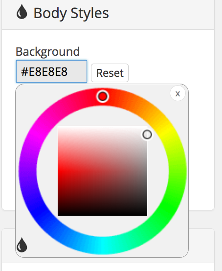

Além disso é possível definir o estilo do cabeçalho do email (Header Styles), sendo basicamente a cor de fundo (Background Color) e a cor do Texto do cabeçalho (Text Color).

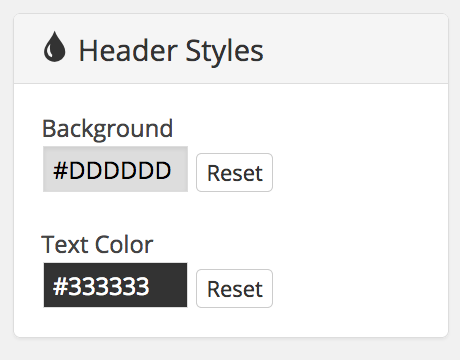

Também é possível definir cores para os conteúdos, cor de fundo (Background), Borda (Border), texto (Text Color) e Link (Link Color).

Todas essas opções podem ser receptadas ao apertar o botão ao lado de cada entrada de cor (Reset).

Além das cores é possível definir o assunto da mensagem:

E se forem email enviados nos Estados Unidos é necessário preencher este campo:

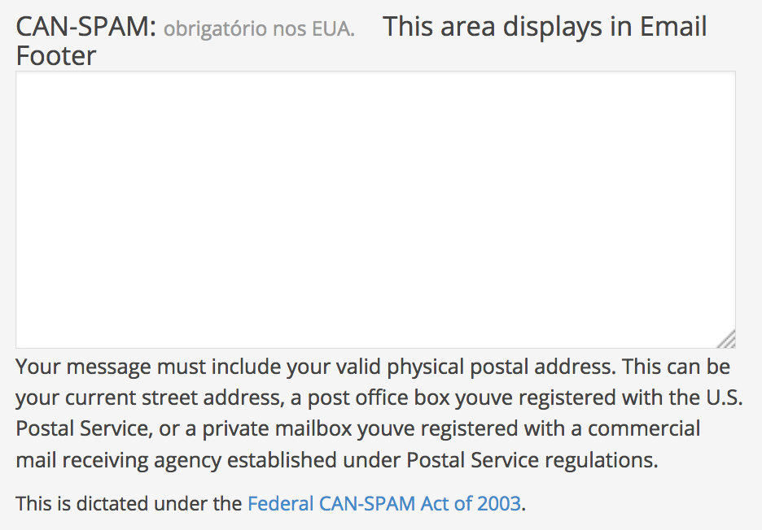

Sua mensagem deve incluir seu endereço postal físico válido. Este pode ser o seu endereço atual, uma caixa de correio que você tenha registrado no Serviço Postal dos Estados Unidos ou uma caixa de correio privada que você tenha registrado em uma agência de correspondência comercial estabelecida de acordo com os regulamentos do Serviço Postal.
