# Fila
A fila basicamente identifica quais mensagens estão para ser enviadas. Ou seja é como uma lista de musicas. A cada x tempo uma nova musica é tocada. Por que não é possível tocar tocas ao mesmo tempo.

Neste caso nosso servidor de email vai ter que aos poucos enviar sua lista de emails. Assim ele pega de x em x emails e envia uma mensagem com seu Email para determinado assinante.

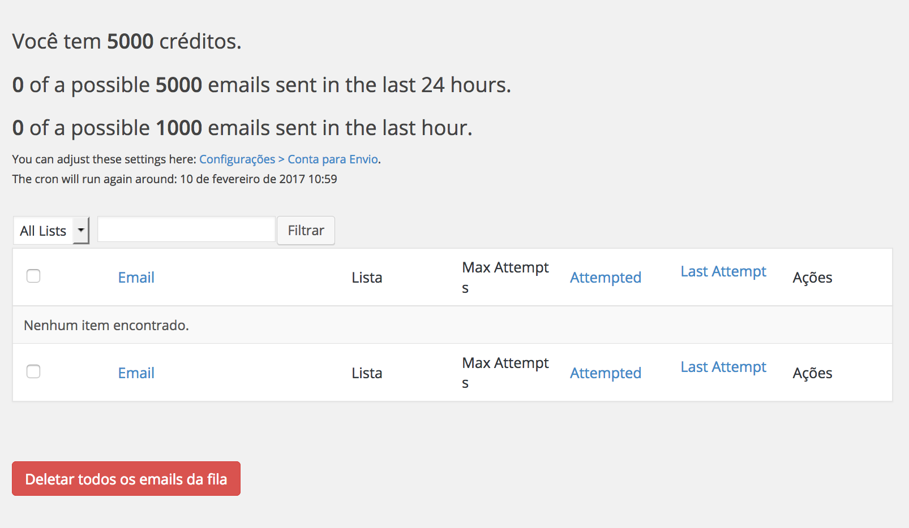

Na rede livre oferecemos uma quantidade especifica de créditos por site. Quando seus créditos acabarem você pode pedir mais.

Basta clicar neste botão:

Xxxxxxx

Note que nos temos as seguintes sessões na área de filas:

### Menu

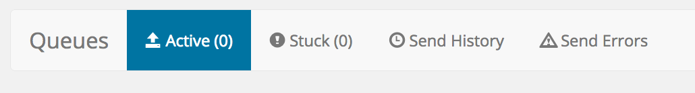

**Active**: Estes são os emails ativos que por algum motivo estão esperando para serem enviados no processo lote de emails.

**Stuck**: Estes são os email que estão presos, que por algum motivo não puderam ser enviados.

**Send History**: Este é o historico de envios de emails.

**Send Errors**: Histórico de erros no envio de mensagens.

### Emails Ativos (Active)

A lista de emails ativos aparece nesta tabela, note que ali você pode ver algumas colunas, a primeira identifica o email de destino (assinante), a segunda mostra a quais listas pertence o assinante. A terceira a quantidade maxima de tentativas, a quarta quantas tentativas foram feitas e qual o momento da ultima tentativa. A ultima colona permite realizar a ação de deletar esse usuários da fila de envio de mensagens pelo servidor.

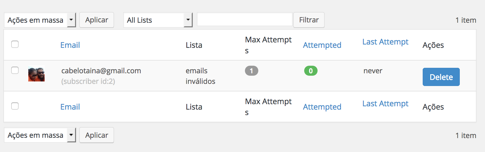

Você também tem possibilidade de remover mais que um email por vez da fila de envio de mensagens:

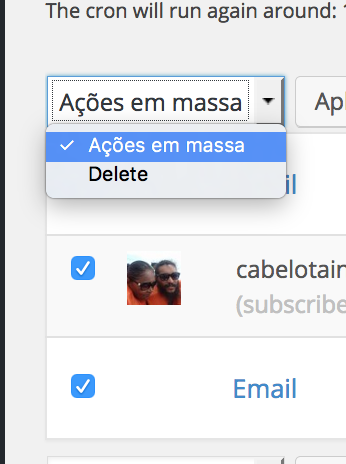

Basta selecionar os emails que quer rede remover e clicar na caixa de seleção e rede remover eles do clicando em deletar.

Se quiser deletar todos os email da fila clique neste botão aqui:

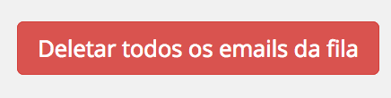

O sistema ainda oferece a possibilidade de filtrar por lista:

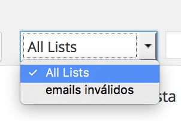

E filtrar por texto:

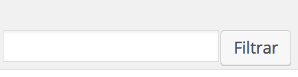

### Emails parados (Stucks)

Esta é uma listas a de mensagens que estão paradas e não podem ser entregues por algum motivo.

Note que os motivos podem ser vários, se o seu servidor não esta com uma conta válida ou se o email inserido não existe o email não pode ser entregue e por isso ele vai para a fila de emails parados.

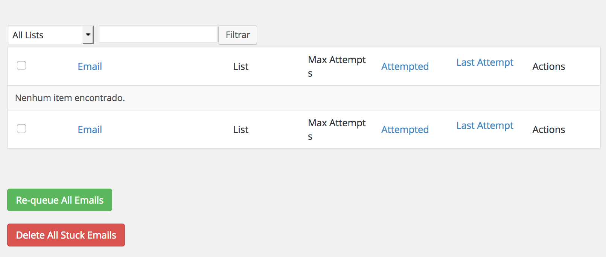

O significado de cada coluna é o mesmo que você vê na sessão anterior que lista os emails que estão na fila.

No entanto existem estão es dois botões abaixo da tabela.

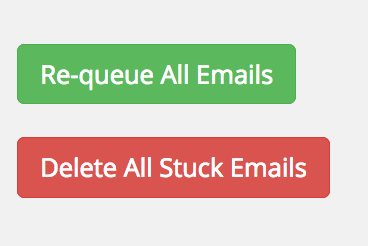

O primeiro botão verde permite colocar todos os emails parados devolta na fila de envio. Esse caso por exemplo por der usado quando o sistema não enviou a mensagem por problemas de configuração.

O segundo delatar todos os emails que não foram enviados é o típico caso de uma situação em que o email não foi entregue pois a conta de email simplesmente não existe.

### Historico de Envios (Send History)

Nesta tela podemos ver o histórico de envio de mensagens, note que temos o email para onde a mensagem foi enviada, temos a lista que pertence o email, temos o assunto do email e qual foi o resultado resultado do envio do email.

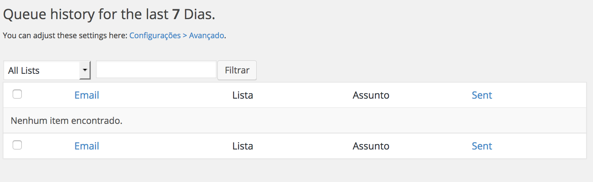

### Histórico de erros no envio de mensagens (Send Errors)

Note que nesta página podemos ver basicamente o erro e alguns detalhes do erro no envio da mensagem. Aqui você pode ver o que aconteceu em, ate 2 semanas.

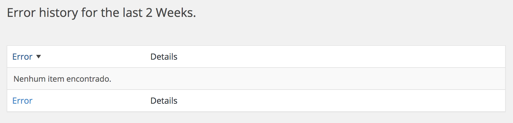

Se tiver algum aporte para essa página mande uma mensagem para contato@redelivre.org.br ou faça um pull request no GitHub com suas melhorias.
